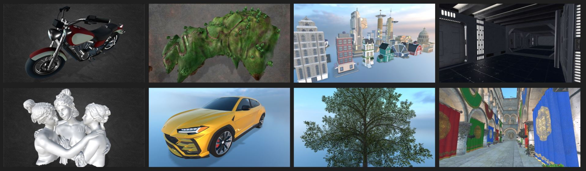
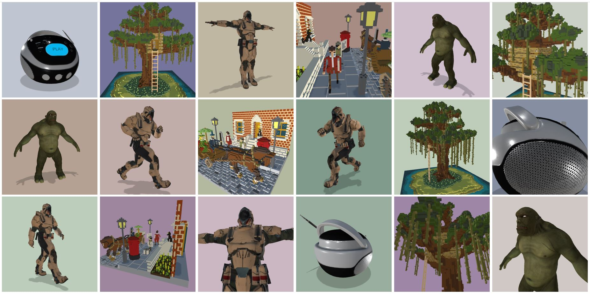

<h1> ProViewer</img></h1>


**ProViewer** is a 3D model viewer for the safe and fast rendering of the most common 3D model files using the [three.js](https://threejs.org/) library. This viewer uses *encryption and decryption* algorithms for the safe transaction of model files on the Internet and protection of model files from illegal copying. Currently, it supports a total of 16 different model file formats, with more to come in the future. Additionally, it will soon offer special shaders and post-processing plugins for realistic rendering and further analysis.

## Supported file formats
**3DS, 3MF, AMF, DAE, FBX, MD2, GLB, GLTF, KMZ, OBJ(MTL), PLY, STL, SVG, VTK, VOX, WRL**

The figures below show the rendered images after loading the sample models. Each of the first 8 images resulted from rendering one model file per viewport, and the remaining 18 images were created at the same time using multiple grid viewports.

<div>


</div>

## Website
You can run this viewer at the website: https://nova-graphix.github.io/proviewer.js/.

## Installation
You can install this viewer (called **proviewer**) to your project by executing:<br>
```sh
npm install proviewer
```
Then, you should include **proviewer** to your project as follows:
```javascript
import { renderModels } from 'proviewer';
renderModels( options );
```
where the **renderModels()** is a JavaScript function that renders models, and the **options** is a JavaScript object that contains the URL of the model.

## Usage
- **Viewing models by dragging and dropping:**
    With the Javascript code below, you can view your model by dragging and dropping your model file on the viewport created by the function **renderModels()**.
    ```javascript
    import { renderModels } from 'proviewer';
    renderModels();
    ```

- **Viewing a specific model:**
    The following code shows an example of rendering a specific model using **renderModels()**. In the code below, **id** is the ID of the \<div> HTML element for the model, **style** is the CSS codes that style the \<div> element, **img** is used for the background image of this viewer, and **url** is for model URLs. You can write one or more model URLs in this **url**. In addition, you can also bundle multiple models into a *zip* file and enter it into this **url**.
    ```javascript
    import { renderModels } from 'proviewer';
    renderModels({
        id:    'model',
        style: 'width:800px; height:600px; border:....',
        img:   'path/to/image.jpg',
        url:   'path/to/model.glb',
    });
    ```

- **Viewing multiple models in grid viewports:**
    As shown above, multiple models can be placed in grid viewports using just one WebGL renderer. In the code below, **id** is the ID of the \<div> HTML element as a model container, and **children** are child elements of this \<div> element, each of which renders a model within its viewport.
    ```javascript
    import { renderModels } from 'proviewer';
    renderModels({
        id: 'models',
        children: [
            { style: "width:300px; height: 300px;", url: "path/to/model_01.glb" },
            { style: "width:300px; height: 300px;", url: "path/to/model_02.zip" },
            { style: "width:300px; height: 300px;", url: "path/to/model_03.stl" },
            ....
        ]
    });
    ```
    Note that the \<canvas> HTML element is created internally, and all models are drawn on this \<canvas> element.

- **Encryption and decryption of model files:**
    The function **openEncryptFiles()** encrypts model files with a model encryption key to prevent illegal copying on the Internet. The encrypted files can return to their original file state through the function **openDecryptFiles()** with a model decryption key. A file dialog box is opened by these functions. Then, the user selects the directory where the files to be encrypted or decrypted exist. When you press the OK button, the encryption or decryption process begins. Note that two secret keys for encryption and decryption are provided only to paid users.
    ```javascript
    import { openEncryptFiles, openDecryptFiles } from 'proviewerx';

    // NOTE-1*: two model secret keys are provided only to paid users
    // NOTE-2*: HTTPS is required for encryption and decryption
    openEncryptFiles( settings.MODEL_ENC_KEY );
    openDecryptFiles( settings.MODEL_DEC_KEY );
    ```
    In the code above, **settings** is an object that plays the same role as *process.env*.

## Functions to assist model viewing
- **background**<br>
    Press the **key b** on your keyboard. Then, you can see that the background image changes. There are approximately 5 background images available.
- **lights**<br>
    Press the **key l** on your keyboard to increase the intensity of light sources illuminating the model. To decrease the light intensity, hold down the **shift key** and press the **key l**.
- **matcap**<br>
    Press the **key m** to apply the *matcap* (material capture) shader. Press it again to remove the shader.
- **normals**<br>
    Press the **key n** to map the normal vectors to RGB colors. Press it again to remove the mapping.
- **animation**<br>
    Press the **key p** to play the model animation. If you want to see the next animation, press the **key p** again. To pause the animation, press the **key o**.
- **wireframe**<br>
    Press the **key w** to view the model's geometry as a wireframe. Press it again to go back.

## Keywords
3D, javascript, html5, WebGL, three.js, model-viewer, 3D-viewer, model-inspector, 3DS, 3MF, AMF, DAE, FBX, MD2, GLB, GLTF, KMZ, OBJ(MTL), PLY, STL, SVG, VTK, VOX, WRL

## Questions or suggestions
Please contact us at <info@nova-graphix.com> for any questions or suggestions.

Thank you for reading the above description on **ProViewer**, developed by [NovaGraphix, Co.](https://www.nova-graphix.com) We will continue to share new features and technologies through [YouTube](https://www.youtube.com/@3D-novagraphix), [Facebook](https://www.facebook.com/NovaGraphixCo), and [Linkedin](https://www.linkedin.com/company/novagraphix/).
